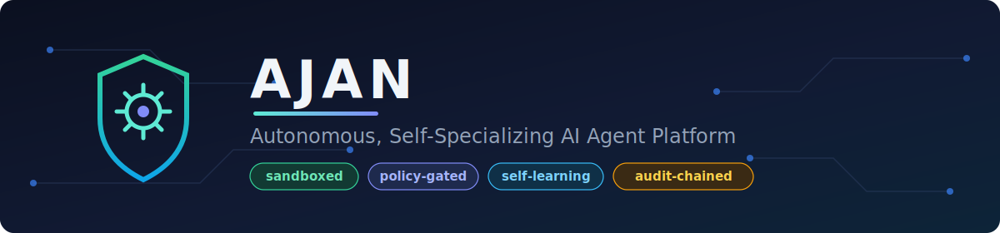
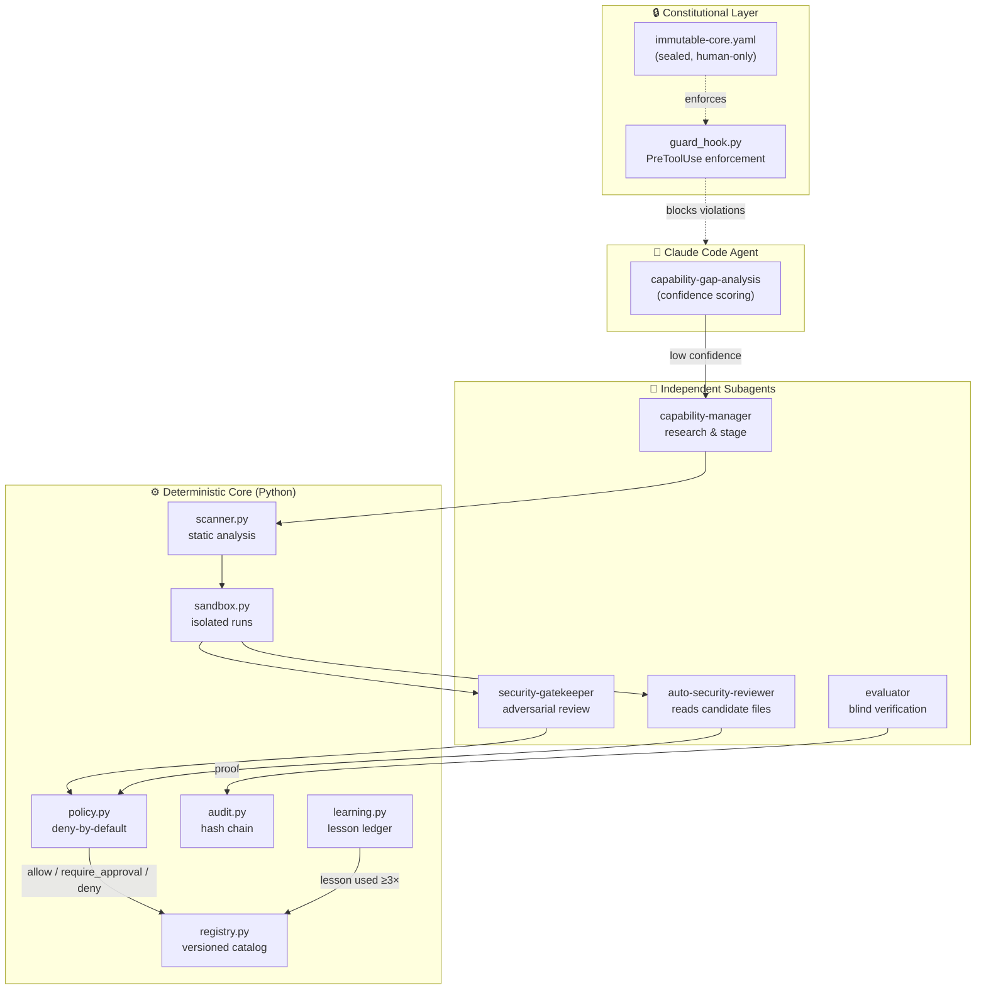
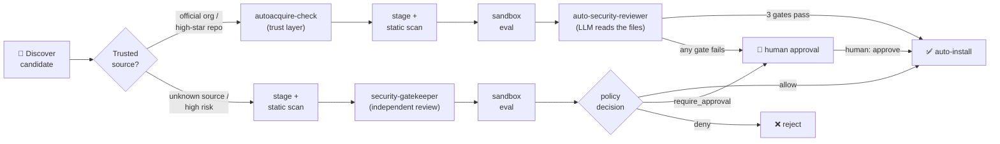
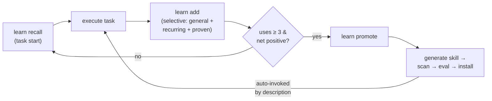

<div align="center">



<br/><br/>

[](LICENSE)
[](https://www.python.org/)
[](tests/)
[](#testing--quality)
[](https://docs.astral.sh/ruff/)
[](SECURITY.md)
[](https://claude.com/claude-code)
[](#contributing)

**English** | [Türkçe](README.tr.md)

*An AI agent that measures its own competence gap, safely acquires the capabilities it lacks —*
*sandbox-tested and policy-gated — and turns repeated, proven lessons into permanent skills.*

[Features](#features) • [How It Works](#how-it-works) • [Installation](#installation) • [Usage](#usage) • [CLI](#cli-reference) • [Security](#security-model) • [Contributing](#contributing) • [Contact](#contact) • [License](#license)

</div>

---

## What is this?

**Chiron** — named after the wise centaur of Greek myth who trained heroes — is a working system that makes an AI agent (Claude Code) apply **expert procedures** to every task, **notice its own missing capabilities**, discover skills/MCPs/tools from trusted sources, and add them to its own capability library in a controlled way — **tested in a sandbox** and **passed through policy gates**. Nothing found on the internet is ever installed directly.

> **Core principle:** the agent is autonomous in research and sandbox testing; permanent installation, broad permissions, production changes and live trading are **deny-by-default** and approval-controlled.

Three layers of behavior:

1. **Do the known correctly** — use verified skills/tools.
2. **Acquire what's missing, safely** — research, scan, sandbox-test, install per policy.
3. **Create new expertise** — if no skill exists, generate one from primary sources, verified by an independent evaluator.

## Features

| | Feature | Description |
|---|---|---|
| 🔍 | **Capability gap analysis** | Before risky/uncertain tasks, the agent measures its own confidence score and decides: proceed / proceed with verification / acquire capability |
| 🛡️ | **Two-lane secure acquisition** | Trusted sources (official orgs, high-star repos) go through an automated lane with 3 mandatory gates; unknown sources require human approval |
| 📦 | **Sandboxed evaluation** | Every candidate runs in process isolation (clean env, network off) against measurable eval specs before promotion |
| 🧠 | **Token-efficient learning** | Lessons live in SQLite, not context; only the 3–5 most relevant short lessons are injected per task |
| ⚡ | **Lessons → skills, automatically** | A lesson used ≥3 times with net-positive outcomes is auto-promoted into a permanent, auto-invocable skill |
| ⚖️ | **Constitutional boundaries** | An immutable policy core that the agent physically *cannot* modify, enforced by a PreToolUse guard hook |
| 🔗 | **Hash-chained audit** | Every decision appended to a tamper-evident audit log; `verify` checks chain integrity |
| 👥 | **Separation of duties** | The agent that finds/does the work can never be the final approver — independent subagents review and verify |
| 🪶 | **Minimalist engineering** | "The best code is the code you never write." A decision ladder prevents unnecessary code, deps and capabilities — security checks are never skipped |
| 🎯 | **Loop engineering + deterministic gate** | `python -m core gate` is a machine-checked Definition-of-Done (tests + coverage + lint + security + integrity) used as the stop condition for `/goal` loops (see [docs/LOOPS.md](docs/LOOPS.md)) |
| 🧭 | **Research-first planning** | Before building, the system studies prior art (`prior-art-research`) and queries GitHub for the best-fit library (`library-discovery` / `github-search`, e.g. three.js for 3D) |
| 🤝 | **Multi-model council** | Claude stays the brain; when stuck it fans the problem out to whatever other providers have a key (NVIDIA NIM, Kimi, OpenAI, Gemini…) for ideas (see [docs/MULTI_MODEL.md](docs/MULTI_MODEL.md)) |
| 🖥️ | **Visual QA** | For UI/3D work, `visual-qa` renders in a real browser, screenshots across viewports, and inspects for defects — syntax passing doesn't prove visual quality |
| 📊 | **Operator visibility** | `kpi` (metrics from audit/registry/lessons), `sbom` (bill of materials), `backlog` (human-only tasks surfaced in one console) |

## How It Works

### Architecture



### Capability acquisition pipeline



The automated lane only applies when risk ∈ {low, medium} and **no dangerous permissions** are requested; otherwise the immutable core forces human review (OAuth / broker / high-risk).

### Self-learning loop



## Installation

```bash
git clone https://github.com/holladevai/chiron.git
cd chiron
pip install -r requirements.txt
python -m core init      # directories, policy seal, seed skill records
python -m core verify    # audit chain + policy integrity
pytest -q                # 54 core tests
```

One-time setup (run by a **human**, because the guard hook and settings are constitutionally protected):

```bash
python scripts/setup_ajan.py
```

### Global install (every project / every IDE)

Works in Cursor / Windsurf / VS Code **via the Claude Code extension**. Once:

```bash
python scripts/install_global.py   # pip install -e . + skills/agents/hooks into ~/.claude
```

This repo is the platform's home; all projects share the same capability library and policies. Details: [docs/IDE.md](docs/IDE.md).

## Usage

### Automatic activation

The system activates itself in every Claude Code session (a `SessionStart` hook injects the working protocol). It can also be toggled from the prompt. The prompt triggers are **literal Turkish phrases** matched by the hook — type them verbatim (or use the language-neutral CLI below):

| Prompt trigger (Turkish, literal) | Meaning | Effect |
|---|---|---|
| `ajan devreye gir` / `/ajan` | "agent, engage" | Enable the protocol |
| `is bitti` / `ajan dur` | "job's done" / "agent, stop" | Disable for this session |

Language-neutral equivalent (recommended in English workflows):

```bash
python -m core ajan on        # enable
python -m core ajan off       # disable
python -m core ajan status    # show state
```

State is persistent (`.ajan_state.json`); default is **on**.

### Typical scenarios

**1 — Risky task: the agent measures itself first**
```text
User:  "Backtest this strategy and verify with the most current method."
Agent: python -m core gap --domain trading --skills backtest-integrity --risk high
       → proceed_with_verification → does the work → evaluator subagent verifies with proof
```

**2 — Missing capability, trusted source (automated lane)**
```text
Agent notices a missing skill → capability-manager finds a candidate (official org repo)
→ autoacquire-check PASS → stage + scan clean → eval PASS
→ auto-security-reviewer APPROVE → installed automatically, no human needed
```

**3 — Missing capability, unknown source (standard lane)**
```text
Candidate from an unknown repo → stage + scan → security-gatekeeper review
→ eval → policy decision: require_approval → approvals/pending/<id>.md
→ HUMAN: python -m core approve <id>
```

**4 — A recurring lesson becomes a skill**
```text
At task end:  learn add "When doing X, check Y first" --domain web
3+ uses, net positive → learn promote <id> → permanent skill, auto-invoked
```

## CLI Reference

```text
python -m core <command> [--root DIR]
```

### Free for the agent (read-only / analysis)

| Command | Purpose |
|---|---|
| `gap` | Competence gap & confidence score report |
| `scan <dir>` | Static security scan of a candidate (prompt injection / exfiltration / pipe-to-shell) |
| `list` / `search` / `report <id>` | Registry catalog, search, full record |
| `stale` | Capabilities awaiting re-verification |
| `verify` | Audit chain + policy integrity check |
| `gate` | **Deterministic Definition-of-Done** — tests + coverage + lint + security + integrity → `done: true/false` (the loop stop condition, see [docs/LOOPS.md](docs/LOOPS.md)) |
| `kpi` | Operational KPIs derived from the audit log + registry + lessons (capability inventory, acquisition funnel, reject/revoke rates, guard-block activity, learning reuse) |
| `sbom` | Software Bill of Materials — dependencies + installed capabilities with content hashes, scan scores and provenance |
| `backlog` | **Human operator console** — one prioritized list of everything only a human can do: capability approvals, agent-filed human tasks, stale revalidations, deliberately-deferred infra/architecture. Writes `human/BACKLOG.md` |
| `request-human` | The agent files a task it *cannot* do itself (infra change, policy edit, prod deploy, dangerous permission) so it persists in the backlog instead of being lost in chat |
| `providers` | List LLM providers whose API key is present in the env (masked) → `solo`/`verify`/`council` mode |
| `consult` | **AI council** — when Claude is stuck, fan the problem out to the *other* providers for ideas/second opinions (see [docs/MULTI_MODEL.md](docs/MULTI_MODEL.md)) |
| `github-search` | Query GitHub for the best-fit library/tool for a task (stars, maintenance, license) — the `library-discovery` skill uses this during planning (e.g. three.js for 3D) |
| `learn recall/add/...` | Lesson ledger (learning) |

### Side effects, policy-gated (agent may use)

| Command | Purpose |
|---|---|
| `stage` | Move candidate to staging (scan + record) |
| `eval` | Run sandbox evaluation |
| `promote` | Promote to installed, per policy decision |
| `revoke` | Revoke / roll back a capability |
| `sandbox-run` | Run a command in the isolated sandbox (clean env, network off) |
| `autoacquire-check` / `autoacquire-promote` | Automated-lane trust check / 3-gate install |

### Human only (guard hook blocks the agent)

| Command | Purpose |
|---|---|
| `approve <id>` | Apply a pending approval |
| `seal-policy` | Seal a change to the immutable core |

## Security Model

- **Nothing from the internet installs directly.** Discovery → scan → independent security review → sandbox eval → policy decision is mandatory.
- **Critical findings auto-reject** a candidate.
- **Separation of duties:** the agent that finds/does the work can never approve it (separate subagents).
- `approve` and `seal-policy` are **human-only**; the guard hook physically blocks the agent.
- The agent can never: modify policies/audit/guard code, write unvetted skills into `.claude/skills/`, touch production, send email, place live trades, withdraw broker funds, or change its own risk limits.
- Policy changes are made only by a **human** and sealed via `python -m core seal-policy`.

## Components

| Layer | Location | Role |
|---|---|---|
| Constitutional policy | `policies/immutable-core.yaml` | Boundaries the agent cannot change (sealed) |
| Policy engine | `core/policy.py` | Deny-by-default, risk-based decisions |
| Static scanner | `core/scanner.py` | Prompt injection / exfiltration / pipe-to-shell detection |
| Registry | `core/registry.py` | Versioned capability catalog (SQLite) |
| Sandbox | `core/sandbox.py` | Portable process isolation (clean env, network off) |
| Confidence | `core/confidence.py` | Evidence-based competence gap scoring |
| Eval runner | `core/evals.py` | Measurable verification tests |
| Pipeline | `core/lifecycle.py` | stage → eval → promote → approve/revoke |
| Audit | `core/audit.py` | Hash-chained, tamper-evident log |
| Learning | `core/learning.py` | Token-efficient lesson ledger |
| Guard hook | `core/guard_hook.py` | Claude Code PreToolUse constitutional enforcement |

## Directory Layout

```text
core/               Python core (policy, scanner, registry, sandbox, evals, lifecycle)
policies/           Deny-by-default policies; immutable-core.yaml is unchangeable
.claude/skills/     ACTIVE (installed) skills — only this directory is loaded
.claude/agents/     Subagent definitions
staging/skills/     Candidates under test (not active)
registry/           Versioned capability catalog (SQLite)
evals/              Measurable verification specs
approvals/pending/  Packages awaiting human approval
audit/              Hash-chained audit log (audit.jsonl)
sandbox/runs/       Isolated working directories
scripts/            Setup helpers (setup_ajan.py, install_global.py)
tests/              Core tests
docs/               IDE / global install docs
```

## Design Rationale

The full design document (in Turkish) lives at
[otonom_uzmanlasan_ai_agent_skills_mcp_mimarisi.md](otonom_uzmanlasan_ai_agent_skills_mcp_mimarisi.md).
Agent working rules: [CLAUDE.md](CLAUDE.md).

## Testing & Quality

Chiron is security-critical, so its test suite goes beyond happy-path unit tests.
Everything below runs in [CI](.github/workflows/ci.yml) on every push and PR, across
Linux/macOS/Windows × Python 3.10–3.12:

| Layer | What it checks |
|---|---|
| **181 tests** (`pytest`) | unit + integration + **adversarial** |
| **Coverage gate** (`coverage.py`) | `fail_under = 85%` (currently ~91%) |
| **Adversarial security tests** | guard-hook bypass, path-traversal, HUMAN-only enforcement, scanner obfuscation/base64/zero-width bypass, sandbox network-kill & timeout & secret-leak, audit tamper/reorder/deletion |
| **Known-gap tracking** | genuine limitations (regex-bypass, audit truncation/re-forge) are pinned as `@pytest.mark.xfail(strict=True)` — if the engine improves, the test flips and forces an update |
| **Lint** (`ruff`) · **Security lint** (`bandit`) · **Dep CVEs** (`pip-audit`) · **Secrets** (`gitleaks` pre-commit) | zero findings |
| **Platform integrity** (`python -m core verify`) | hash-chained audit + sealed policy intact |

Run it all locally: `make all` (or see [CONTRIBUTING.md](CONTRIBUTING.md) for the raw commands).

### Loop engineering (NASA-grade lifecycle)

Chiron turns the agent into a rigorous software team: a **deterministic
Definition-of-Done gate** (`python -m core gate`) is the machine-checked stop
condition for a `/goal` loop, and two installed skills (`software-lifecycle`,
`loop-engineering`) encode the plan → develop → test → independent-review → verify
process — with a fresh-context `sw-reviewer` subagent for the review stage. Full
guide: **[docs/LOOPS.md](docs/LOOPS.md)**.

> Dogfooding: those two skills were **not** hand-placed into `.claude/skills/` —
> they were installed through the platform's own pipeline
> (`stage → scan → sandbox eval → promote`), proving the safe-acquisition flow on itself.

### Multi-model council (Claude stays the brain)

The main brain is Claude. When it gets **stuck** on a hard problem, Chiron can fan
the problem out to **whatever other AI providers have an API key in the env**
(**NVIDIA NIM** — best open *coding* models like Qwen3-Coder-480B/DeepSeek/Kimi K2 —
plus Moonshot/Kimi, Fireworks, Together, OpenAI, Gemini, Mistral, DeepSeek, Groq,
xAI, OpenRouter, local Ollama) and gather
their ideas for Claude to synthesize — inspired by Sakana AI's *"LLM dream team, not
a single model"* and *"different model per role"*. **Graceful degradation:** with
0–1 keys it runs solo (today's behavior); with 2 it can cross-verify; with 3+ it
convenes a council. Keys are read only from env and **masked** in the audit log.

```bash
python -m core providers                     # which providers are available (masked)
python -m core consult "hard question" --context-file bug.py
```

The `ai-council` skill tells Claude *when* to consult (repeated failure, hard design
call, "best approach"); it is invoked **only when needed**, never every turn. Full
guide: **[docs/MULTI_MODEL.md](docs/MULTI_MODEL.md)**.

> Note on adversarial tests: constitutionally protected modules (`policy.py`,
> `guard_hook.py`, `audit.py`) are **tested, never modified** — the tests lock in their
> current guarantees and expose what they don't yet catch.

## Contributing

Issues and PRs are welcome — including **community-contributed skills**, which go through
the same staging → scan → sandbox eval → review pipeline the platform itself uses.
Every PR is automatically tested by CI (pytest + integrity checks + static security scan).

See **[CONTRIBUTING.md](CONTRIBUTING.md)** for the full guide, and use the
[issue templates](.github/ISSUE_TEMPLATE/) to report bugs, request features or propose skills.
Security vulnerabilities: see [SECURITY.md](SECURITY.md).

Ground rules:

- **Ponytail philosophy:** no unnecessary code, dependencies or capabilities. If stdlib suffices, use stdlib.
- **Security is exempt from minimalism** — never weaken scanning, policy gates, audit or the guard hook.
- Run `pytest -q` and `python -m core verify` before submitting.
- Changes to `policies/`, `core/guard_hook.py`, `core/policy.py`, `core/audit.py` require explicit maintainer sign-off (they are constitutionally protected).

## Contact

- 📧 **Email:** devaikaga@gmail.com
- 📍 **Location:** Antalya, Türkiye 🇹🇷

## License

**[PolyForm Noncommercial License 1.0.0](LICENSE)** — the source is open to read, use and modify, but **commercial use is prohibited**.

- ✅ Personal use, research, education, experimentation, nonprofit use
- ❌ Any commercial use (embedding in products/services, selling, running in commercial operations)

© 2026 holladevai. All rights reserved except as granted by the license.
