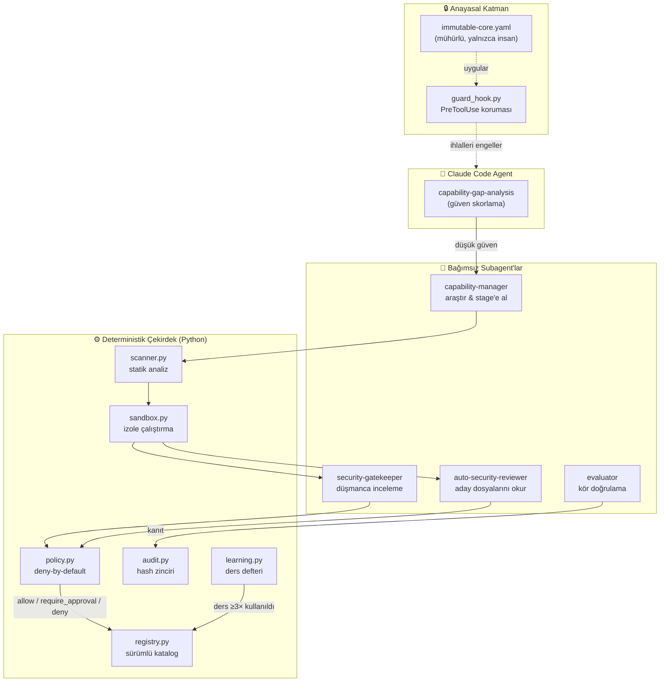
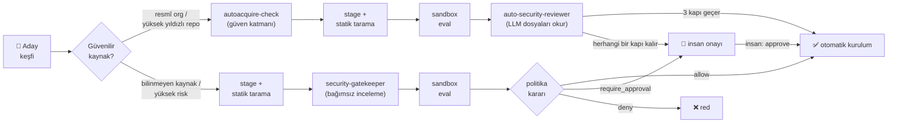
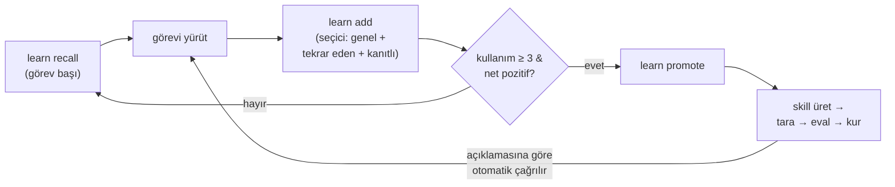

<div align="center">


<br/><br/>

[](LICENSE)
[](https://www.python.org/)
[](tests/)
[](#test--kalite)
[](https://docs.astral.sh/ruff/)
[](https://claude.com/claude-code)

[English](README.md) | **Türkçe**

*Kendi yetkinlik açığını ölçen, eksik yeteneği güvenle edinen —*
*sandbox'ta test edilmiş ve politika kapılı — tekrar eden kanıtlı dersleri kalıcı skill'e dönüştüren bir AI agent.*

[Özellikler](#özellikler) • [Nasıl Çalışır](#nasıl-çalışır) • [Kurulum](#kurulum) • [Kullanım](#kullanım) • [CLI](#cli-referansı) • [Güvenlik](#güvenlik-modeli) • [Katkı](#katkı) • [İletişim](#i̇letişim) • [Lisans](#lisans)

</div>

---

## Bu nedir?

**Chiron** — adını Yunan mitolojisinde kahramanları eğiten bilge kentaurdan alır — bir AI agent'ın (Claude Code) her görevde **uzman prosedürleri** uygulamasını, **eksik yeteneklerini kendisinin fark etmesini**, güvenilir kaynaklardan skill/MCP/tool bulmasını ve bunları **sandbox'ta test ederek**, **politika kapılarından geçirerek** kendi yetenek kütüphanesine kontrollü biçimde eklemesini sağlayan çalışır bir sistemdir. İnternetten bulunan hiçbir şey doğrudan kurulmaz.

> **Ana ilke:** Agent araştırmada ve sandbox testinde otonomdur; kalıcı kurulum, geniş yetki, production değişikliği ve canlı trading **deny-by-default** ve onay kontrollüdür.

Üç katmanlı davranış:

1. **Bilineni doğru yap** — doğrulanmış skill/tool kullan.
2. **Eksik yeteneği güvenli edin** — araştır, tara, sandbox'ta test et, politikaya göre kur.
3. **Yeni uzmanlık üret** — skill yoksa birincil kaynaklardan üret, bağımsız evaluator doğrulasın.

## Özellikler

| | Özellik | Açıklama |
|---|---|---|
| 🔍 | **Yetkinlik açığı analizi** | Riskli/belirsiz görevden önce agent kendi güven skorunu ölçer: yürüt / doğrulayarak yürüt / yetenek edin |
| 🛡️ | **İki şeritli güvenli edinme** | Güvenilir kaynak (resmî org, yüksek yıldızlı repo) 3 zorunlu kapılı otomatik şeritten geçer; bilinmeyen kaynak insan onayı gerektirir |
| 📦 | **Sandbox değerlendirme** | Her aday, kuruluma taşınmadan önce süreç izolasyonunda (temiz env, ağ kapalı) ölçülebilir eval spec'lerine karşı çalıştırılır |
| 🧠 | **Token-verimli öğrenme** | Dersler context'te değil SQLite'ta yaşar; görev başına yalnızca en ilgili 3–5 kısa ders enjekte edilir |
| ⚡ | **Dersten otomatik skill** | ≥3 kez kullanılan, net pozitif ders kalıcı ve otomatik çağrılabilir skill'e terfi eder |
| ⚖️ | **Anayasal sınırlar** | Agent'ın fiziksel olarak *değiştiremediği* değişmez politika çekirdeği; PreToolUse guard hook ile uygulanır |
| 🔗 | **Hash-zincirli audit** | Her karar kurcalanamaz audit log'una eklenir; `verify` zincir bütünlüğünü denetler |
| 👥 | **Görev ayrılığı** | İşi yapan/bulan agent asla nihai onaylayıcı olamaz — bağımsız subagent'lar inceler ve doğrular |
| 🪶 | **Minimalist mühendislik** | "En iyi kod, hiç yazmadığın koddur." Karar merdiveni gereksiz kod/bağımlılık/yeteneği önler — güvenlik denetimleri asla atlanmaz |

## Nasıl Çalışır

### Mimari



### Yetenek edinme hattı



Otomatik şerit yalnızca risk ∈ {low, medium} ve **tehlikeli izin yok** ise geçerlidir; aksi hâlde immutable-core insan incelemesini zorunlu kılar (OAuth / broker / yüksek risk).

### Kendi kendine öğrenme döngüsü



## Kurulum

```bash
git clone https://github.com/holladevai/chiron.git
cd chiron
pip install -r requirements.txt
python -m core init      # dizinler, politika mührü, seed skill kayıtları
python -m core verify    # audit zinciri + politika bütünlüğü
pytest -q                # 54 çekirdek testi
```

İlk kurulumda bir kez (guard hook ve settings anayasal korumalı olduğundan **insan** çalıştırır):

```bash
python scripts/setup_ajan.py
```

### Global kurulum (her projede / her IDE'de)

Cursor / Windsurf / VS Code'da **Claude Code eklentisiyle** çalışır. Bir kez:

```bash
python scripts/install_global.py   # pip install -e . + ~/.claude'a skills/agents/hooks
```

Platformun evi bu repodur; tüm projeler aynı yetenek kütüphanesini ve politikaları paylaşır. Ayrıntı: [docs/IDE.md](docs/IDE.md).

## Kullanım

### Otomatik aktivasyon

Sistem her Claude Code oturumunda kendiliğinden devreye girer (`SessionStart` hook'u çalışma protokolünü enjekte eder). Prompt'tan da kontrol edilir:

| Prompt komutu | Etki |
|---|---|
| `ajan devreye gir` / `/ajan` | Protokolü açar |
| `is bitti` / `ajan dur` | Bu oturumda kapatır |

Durum kalıcıdır (`.ajan_state.json`); varsayılan **açık**. Elle: `python -m core ajan on|off|status`.

### Tipik senaryolar

**1 — Riskli görev: agent önce kendini ölçer**
```text
Kullanıcı: "Şu stratejiyi backtest et, en güncel yöntemle doğrula."
Agent:  python -m core gap --domain trading --skills backtest-integrity --risk high
        → proceed_with_verification → işi yapar → evaluator subagent kanıtla doğrular
```

**2 — Eksik yetenek, güvenilir kaynak (otomatik şerit)**
```text
Agent eksik skill fark eder → capability-manager aday bulur (resmî org reposu)
→ autoacquire-check PASS → stage + tarama temiz → eval PASS
→ auto-security-reviewer APPROVE → otomatik kurulur, insan gerekmez
```

**3 — Eksik yetenek, bilinmeyen kaynak (standart şerit)**
```text
Aday bilinmeyen repo'dan → stage + tarama → security-gatekeeper incelemesi
→ eval → politika kararı: require_approval → approvals/pending/<id>.md
→ İNSAN: python -m core approve <id>
```

**4 — Tekrarlayan ders skill olur**
```text
Görev sonunda:  learn add "X yaparken önce Y'yi kontrol et" --domain web
3+ kullanım, net pozitif → learn promote <id> → kalıcı skill, otomatik çağrılır
```

## CLI Referansı

```text
python -m core <komut> [--root DIZIN]
```

### Agent'ın serbestçe kullanabildiği (salt-okunur / analiz)

| Komut | İşlev |
|---|---|
| `gap` | Yetkinlik açığı ve güven skoru raporu |
| `scan <dizin>` | Aday statik güvenlik taraması (prompt injection / exfiltration / pipe-to-shell) |
| `list` / `search` / `report <id>` | Registry kataloğu, arama, tam kayıt |
| `stale` | Yeniden doğrulama bekleyenler |
| `verify` | Audit zinciri + politika bütünlüğü |
| `gate` | **Deterministik Definition-of-Done** — test + kapsam + lint + güvenlik + bütünlük → `done: true/false` (loop durma koşulu, bkz. [docs/LOOPS.md](docs/LOOPS.md)) |
| `kpi` | Audit + registry + derslerden türetilen operasyonel KPI'lar (yetenek envanteri, edinme hunisi, red/iptal oranları, guard-blok etkinliği, öğrenme yeniden-kullanımı) |
| `sbom` | Yazılım Malzeme Listesi — bağımlılıklar + kurulu yetenekler (içerik hash'i, tarama skoru, köken) |
| `providers` | Env'de anahtarı mevcut LLM sağlayıcıları (maskeli) → `solo`/`verify`/`council` modu |
| `consult` | **AI kurulu** — Claude takılınca problemi *diğer* sağlayıcılara dağıtıp fikir alır (bkz. [docs/MULTI_MODEL.md](docs/MULTI_MODEL.md)) |
| `learn recall/add/...` | Ders defteri (öğrenme) |

### Yan etkili, politika kapılı (agent kullanabilir)

| Komut | İşlev |
|---|---|
| `stage` | Adayı staging'e al (tarama + kayıt) |
| `eval` | Sandbox eval çalıştır |
| `promote` | Politika kararıyla kuruluma taşı |
| `revoke` | Yeteneği iptal et / geri al |
| `sandbox-run` | Komutu izole sandbox'ta çalıştır (temiz env, ağ kapalı) |
| `autoacquire-check` / `autoacquire-promote` | Otomatik şerit güven kontrolü / 3 kapılı kurulum |

### Yalnızca İNSAN (guard hook agent'ı engeller)

| Komut | İşlev |
|---|---|
| `approve <id>` | Bekleyen onayı uygula |
| `seal-policy` | immutable-core değişikliğini mühürle |

## Güvenlik Modeli

- **İnternetten hiçbir şey doğrudan kurulmaz.** Keşif → tarama → bağımsız güvenlik incelemesi → sandbox eval → politika kararı zorunludur.
- **Kritik bulgulu aday otomatik reddedilir.**
- **Görev ayrılığı:** işi yapan/bulan agent onu onaylayamaz (ayrı subagent'lar).
- `approve` ve `seal-policy` **yalnızca insan**; guard hook agent'ı fiziksel olarak engeller.
- Agent asla yapamaz: politika/audit/guard kodunu değiştirmek, `.claude/skills/` altına denetimsiz skill koymak, production'a dokunmak, e-posta göndermek, canlı trade açmak, broker'dan para çekmek, kendi risk limitlerini değiştirmek.
- Politika değişikliğini yalnızca **insan** yapar ve `python -m core seal-policy` ile mühürler.

## Bileşenler

| Katman | Konum | İşlev |
|---|---|---|
| Anayasal politika | `policies/immutable-core.yaml` | Agent'ın değiştiremeyeceği sınırlar (mühürlü) |
| Politika motoru | `core/policy.py` | Deny-by-default, risk temelli karar |
| Statik tarayıcı | `core/scanner.py` | Prompt injection / exfiltration / pipe-to-shell tespiti |
| Registry | `core/registry.py` | SQLite sürümlü yetenek kataloğu |
| Sandbox | `core/sandbox.py` | Taşınabilir süreç izolasyonu (temiz env, ağ kapalı) |
| Güven skoru | `core/confidence.py` | Kanıta dayalı yetkinlik açığı ölçümü |
| Eval runner | `core/evals.py` | Ölçülebilir doğrulama testleri |
| Pipeline | `core/lifecycle.py` | stage → eval → promote → approve/revoke |
| Audit | `core/audit.py` | Hash-zincirli, kurcalanamaz denetim kaydı |
| Öğrenme | `core/learning.py` | Token-verimli ders defteri |
| Guard hook | `core/guard_hook.py` | Claude Code PreToolUse anayasal koruma |

## Dizin Yapısı

```text
core/               Python çekirdek (policy, scanner, registry, sandbox, evals, lifecycle)
policies/           Deny-by-default politikalar; immutable-core.yaml değiştirilemez
.claude/skills/     AKTİF (yüklü) skill'ler — yalnızca burası yüklenir
.claude/agents/     Subagent tanımları
staging/skills/     Test edilen adaylar (aktif değil)
registry/           Sürümlü yetenek kataloğu (SQLite)
evals/              Ölçülebilir doğrulama spec'leri
approvals/pending/  İnsan onayı bekleyen paketler
audit/              Hash-zincirli denetim kaydı (audit.jsonl)
sandbox/runs/       İzole çalışma dizinleri
scripts/            Kurulum yardımcıları (setup_ajan.py, install_global.py)
tests/              Çekirdek testleri
docs/               IDE / global kurulum dokümanı
```

## Tasarım Gerekçesi

Tam tasarım dokümanı: [otonom_uzmanlasan_ai_agent_skills_mcp_mimarisi.md](otonom_uzmanlasan_ai_agent_skills_mcp_mimarisi.md).
Agent çalışma kuralları: [CLAUDE.md](CLAUDE.md).

## Test & Kalite

Chiron güvenlik-kritik olduğu için test paketi mutlu-yol unit testlerinin ötesine geçer.
Aşağıdakilerin tümü her push ve PR'da [CI](.github/workflows/ci.yml)'da, Linux/macOS/Windows ×
Python 3.10–3.12 matrisinde çalışır:

| Katman | Ne denetler |
|---|---|
| **127 test** (`pytest`) | unit + integration + **düşmanca (adversarial)** |
| **Kapsam kapısı** (`coverage.py`) | `fail_under = %85` (şu an ~%88) |
| **Düşmanca güvenlik testleri** | guard-hook atlatma, path-traversal, insan-only zorlama, scanner obfuscation/base64/sıfır-genişlik bypass, sandbox ağ-kesme & timeout & secret-sızıntısı, audit kurcalama/sıralama/silme |
| **Bilinen-boşluk takibi** | gerçek sınırlar (regex-bypass, audit truncation/re-forge) `@pytest.mark.xfail(strict=True)` ile sabitlenir — motor gelişirse test döner ve güncelleme zorlar |
| **Lint** (`ruff`) · **Güvenlik lint** (`bandit`) · **Bağımlılık CVE** (`pip-audit`) · **Secret** (`gitleaks`) | sıfır bulgu |
| **Platform bütünlüğü** (`python -m core verify`) | hash-zincirli audit + mühürlü politika sağlam |

Hepsini yerelde çalıştır: `make all` (ham komutlar için [CONTRIBUTING.md](CONTRIBUTING.md)).

### Loop engineering (NASA-seviyesi yaşamdöngüsü)

Chiron, agent'ı katı bir yazılım ekibine dönüştürür: **deterministik
Definition-of-Done kapısı** (`python -m core gate`) bir `/goal` loop'unun
makine-doğrulamalı durma koşuludur; iki kurulu skill (`software-lifecycle`,
`loop-engineering`) plan → geliştir → test → bağımsız-review → doğrula sürecini
kodlar — review aşaması için taze-bağlam `sw-reviewer` subagent'ıyla. Tam
rehber: **[docs/LOOPS.md](docs/LOOPS.md)**.

> Dogfood: bu iki skill `.claude/skills/` altına elle konmadı — platformun kendi
> hattından (`stage → tarama → sandbox eval → promote`) geçirilerek kuruldu.

### Çoklu-model danışma kurulu (ana beyin Claude kalır)

Ana beyin Claude'dur. Bir işte **takıldığında** Chiron, problemi env'de **anahtarı
mevcut** olan diğer AI sağlayıcılara (**NVIDIA NIM** — en iyi açık *kodlama* modelleri
Qwen3-Coder-480B/DeepSeek/Kimi K2 — ayrıca Moonshot/Kimi, Fireworks, Together, OpenAI,
Gemini, Mistral, DeepSeek, Groq, xAI, OpenRouter, yerel Ollama) dağıtıp fikirlerini
toplar; Claude sentezler — Sakana AI'nin
*"tek model değil, model takımı"* ve *"role göre farklı model"* fikrinden esinle.
**Zarif bozulma:** 0–1 anahtarla solo (bugünkü davranış), 2 ile çapraz-doğrulama,
3+ ile kurul. Anahtarlar yalnızca env'den okunur ve audit'e **maskeli** yazılır.

```bash
python -m core providers                     # mevcut sağlayıcılar (maskeli)
python -m core consult "zor soru" --context-file bug.py
```

`ai-council` skill'i Claude'a **ne zaman** danışacağını söyler (tekrarlayan hata,
zor tasarım kararı, "en iyi yaklaşım"); **yalnızca gerektiğinde** çağrılır, her
turda değil. Tam rehber: **[docs/MULTI_MODEL.md](docs/MULTI_MODEL.md)**.

> Düşmanca test notu: anayasal korumalı modüller (`policy.py`, `guard_hook.py`, `audit.py`)
> **test edilir, asla değiştirilmez** — testler mevcut garantileri kilitler ve henüz
> yakalamadıklarını görünür kılar.

## Katkı

Issue ve PR'lar memnuniyetle karşılanır — **topluluk katkısı skill'ler** dahil; bunlar
platformun kendisinin kullandığı staging → tarama → sandbox eval → inceleme hattından geçer.
Her PR, CI tarafından otomatik test edilir (pytest + bütünlük denetimi + statik güvenlik taraması).

Tam rehber: **[CONTRIBUTING.md](CONTRIBUTING.md)** — hata bildirimi, özellik isteği ve skill
önerisi için [issue şablonlarını](.github/ISSUE_TEMPLATE/) kullanın.
Güvenlik açıkları: [SECURITY.md](SECURITY.md).

Temel kurallar:

- **Ponytail felsefesi:** gereksiz kod, bağımlılık veya yetenek yok. Stdlib yetiyorsa stdlib.
- **Güvenlik minimalizmden muaftır** — tarama, politika kapıları, audit veya guard hook asla zayıflatılmaz.
- Göndermeden önce `pytest -q` ve `python -m core verify` çalıştırın.
- `policies/`, `core/guard_hook.py`, `core/policy.py`, `core/audit.py` değişiklikleri maintainer onayı gerektirir (anayasal korumalıdır).

## İletişim

- 📧 **E-posta:** devaikaga@gmail.com
- 📍 **Konum:** Antalya, Türkiye 🇹🇷

## Lisans

**[PolyForm Noncommercial License 1.0.0](LICENSE)** — kaynak okumaya, kullanmaya ve değiştirmeye açıktır, ancak **ticari kullanım yasaktır**.

- ✅ Kişisel kullanım, araştırma, eğitim, deneme, kâr amacı gütmeyen kullanım
- ❌ Her türlü ticari kullanım (ürün/hizmete gömme, satma, ticari operasyonda çalıştırma)

© 2026 holladevai. Lisansla verilen izinler dışında tüm hakları saklıdır.
